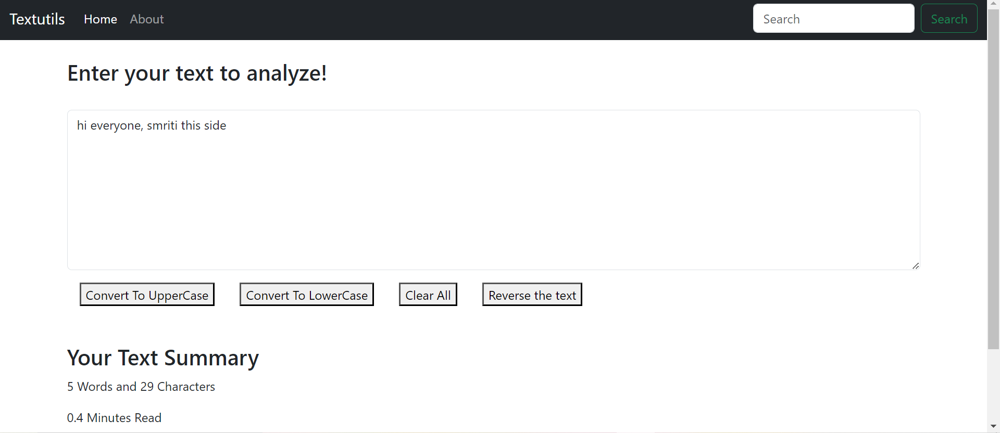

# Getting Started with Create React App

Hi everyone,TextUtil Website is a very basic website which requires the use of react.js  i.e it helps the user to analyse there text!

The website looks like:

Convert To UpperCase:

Convert To LowerCase:

Reverse the Text:

